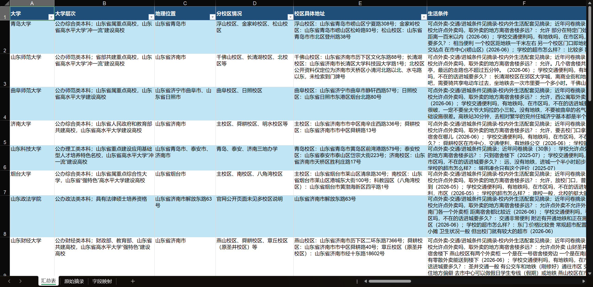
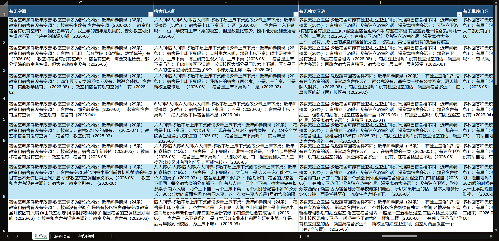

# College Research Skill

> 根据志愿表自动调研院校硬件条件、校区地址、住宿与生活信息的 Codex Skill。  
> 官方公开信息负责“定事实”，CollegesChat 问卷负责“补体验”，最终输出可读 Excel。


## 它能做什么

`college-research` 读取用户的志愿表 Excel，提取其中学校名单，并生成：

```text
output/志愿院校硬件条件调研表.xlsx
```

它重点解决这类问题：

- 学校层次、城市、分校区情况是什么？
- 具体校区地址在哪里，能不能精确到 `xx路xx号`？
- 宿舍几人间、有无空调、有无独卫？
- 早晚自习、早操、门禁、断电断网情况如何？
- 校园周边生活条件、交通、外卖、商圈是否方便？
- 每条非官方体验信息能不能追溯到问卷问题和时间？

## Demo





## 工作簿结构

| Sheet | 内容 |
|---|---|
| `汇总表` | 每所学校一行，包含校区地址、生活条件、宿舍、作息、门禁、断电断网等汇总 |
| `原始摘录` | CollegesChat 问卷问题、时间、摘录、页面链接 |
| `字段映射` | Excel 字段与问卷问题/官方资料的对应关系 |

最终表格会去掉中间态字段：

- `CollegesChat命中状态`
- `问卷证据概况`
- `冲突提示`
- `说明` sheet

## 信息来源策略

| 字段 | 优先来源 | 处理方式 |
|---|---|---|
| 大学层次、城市、校区地址 | 学校官网、招生章程、官方简介 | 作为事实字段写入 |
| 宿舍、空调、独卫、早操、门禁 | CollegesChat 问卷 | 写成问卷证据，不当作官方承诺 |
| 生活条件、交通、外卖、商圈 | 问卷摘录、官方交通信息 | 先汇总，再列问题和时间 |
| 查不到的信息 | 空白或 `待补充/待核验` | 不推测、不编造 |

## Codex 项目级 Skill 配置

推荐把本目录作为项目级 Skill 放到项目根目录的 `.agents/skills/` 下：

```text
your-project/
  .agents/
    skills/
      college-research/
        SKILL.md
        README.md
        scripts/
        references/
        config/
```

PowerShell 示例：

```powershell
New-Item -ItemType Directory -Force .agents\skills | Out-Null
Copy-Item -Recurse volunteer-skills\college-research .agents\skills\college-research
```

配置后重新打开或刷新 Codex 会话，在请求里点名 `college-research` 即可触发，例如：

```text
使用 college-research。我已经把志愿表 Excel 放到 input/志愿表.xlsx。
请按表格里的学校顺序检索官方信息和 CollegesChat，生成硬件条件调研表。
```

## 使用流程

将志愿表放入：

```text
input/志愿表.xlsx
```

先提取学校名单：

```powershell
conda run -n base python scripts/run.py extract-schools --input input\志愿表.xlsx
```

Agent 联网检索官方信息后写入：

```text
work/official_sources.json
```

再执行：

```powershell
conda run -n base python scripts/run.py collect-collegeschat
conda run -n base python scripts/run.py merge
conda run -n base python scripts/run.py build-xlsx
conda run -n base python scripts/run.py validate
```

一键运行脚本化阶段：

```powershell
conda run -n base python scripts/run.py run --input input\志愿表.xlsx
```

## 对话示例

**用户**

```text
使用 college-research。我有一份山东志愿表，放在 input/志愿表.xlsx。
我要每个学校的层次、校区地址、宿舍、空调、独卫、门禁、断电断网和生活条件。
最后输出 Excel，不要 Markdown。
```

**Agent**

```text
我会先读取志愿表，提取学校并保持原顺序。
随后检索学校官网/招生章程补官方字段，再抓取 CollegesChat 问卷补生活条件。
问卷信息会标注问题和月份，查不到的地方留空或标待核验。
```

**用户**

```text
宿舍地理位置那列不要写泛泛位置，要写具体校区地址，最好到路号。
生活条件里要把外卖、交通、商圈这些合起来总结。
```

**Agent**

```text
明白。最终表保留“校区具体地址”和“生活条件”，去掉中间状态列和说明 sheet。
每个生活条件单元格先给摘要，再列近年问卷摘录。
```

**最终产物**

```text
output/志愿院校硬件条件调研表.xlsx
```

## 目录说明

```text
college-research/
  SKILL.md                     # Codex Skill 入口协议
  README.md                    # 当前说明
  DEMO.png                     # 输出表格示例图
  DEMO2.png                    # 输出表格示例图
  scripts/run.py               # CLI 入口
  scripts/college_research/    # 学校提取、CollegesChat、合并、Excel 生成
  references/                  # Agent 工作流和数据契约
  config/                      # 学校别名、字段映射、校区地址补丁
```

## 注意事项

- CollegesChat 是学生问卷汇总，不是学校官方口径。
- 宿舍条件可能因校区、学院、年级、新老宿舍楼而变化。
- 官方字段优先用学校官网、招生网、招生章程等来源。
- 查不到的信息不要猜；留空、标注待核验，比写错更有价值。
